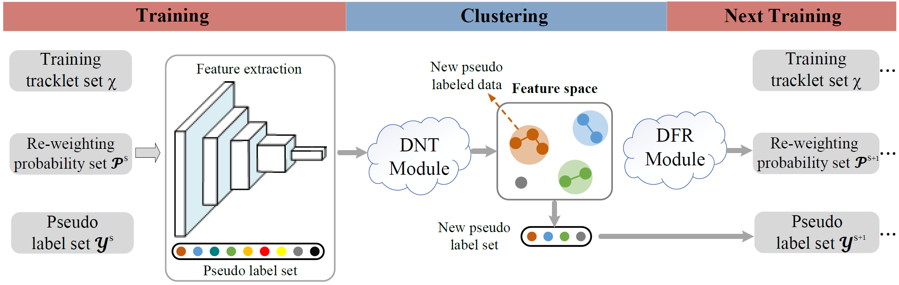
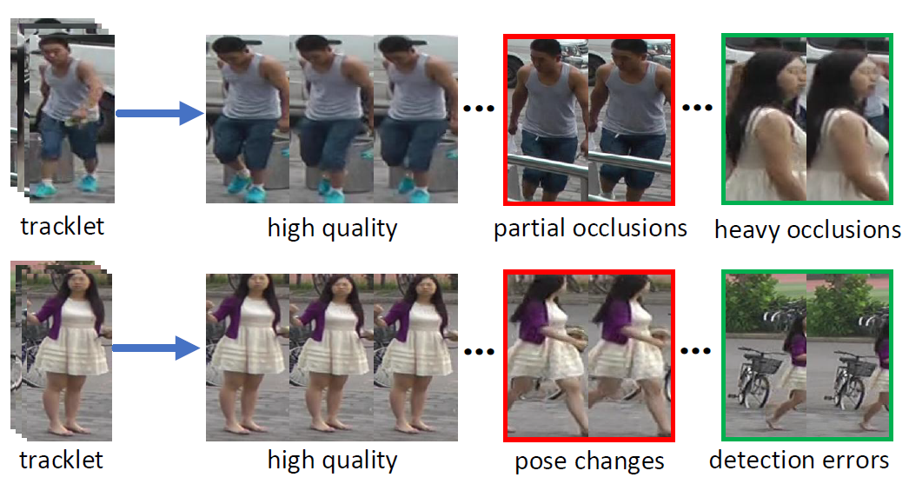
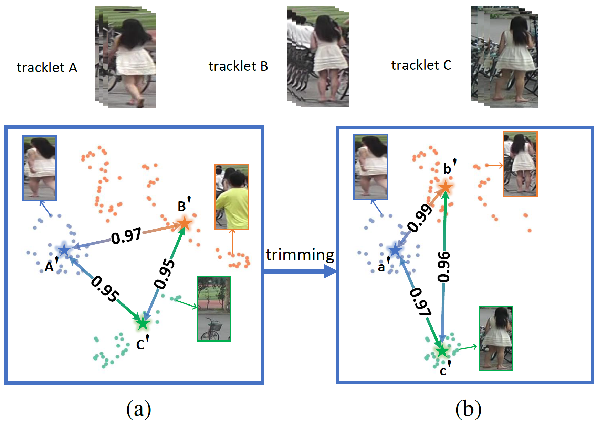
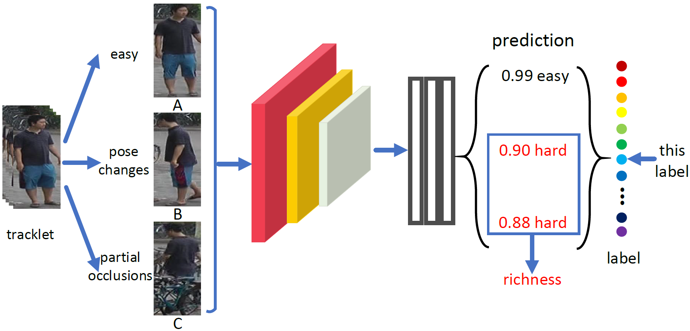
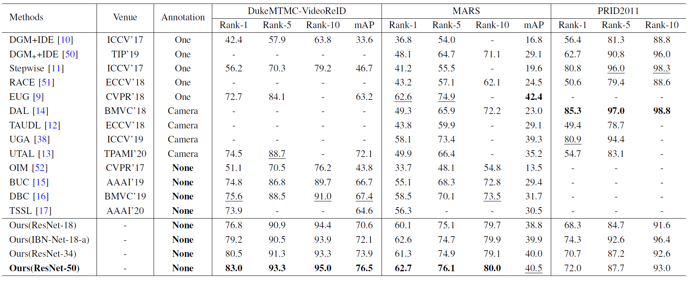
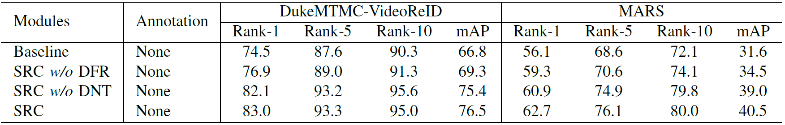
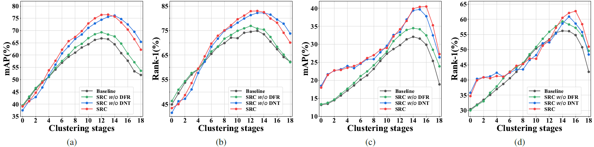
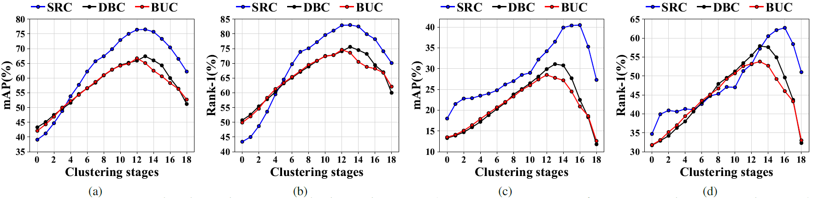
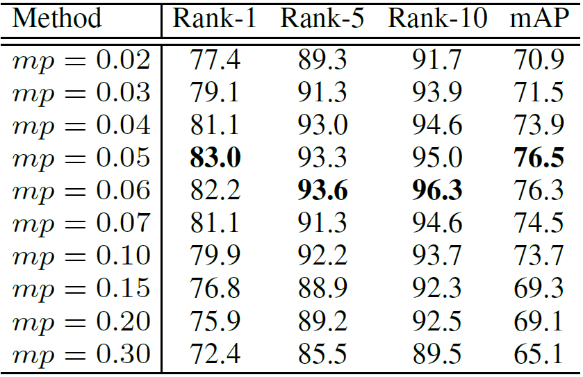
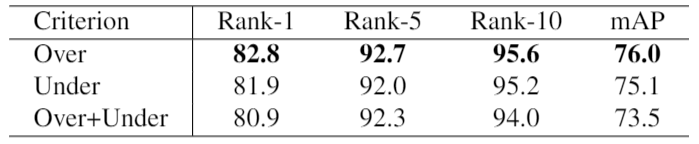

# Sampling and Re-weighting: Towards Diverse Frame Aware Unsupervised Video Person Re-identification

The *official* repository for [Sampling and Re-weighting: Towards Diverse Frame Aware Unsupervised Video Person Re-identification](https://github.com/xpyqiubai/Unsupervised-Video-Person-reID-Diverse-Frame), IEEE Trans. Multimedia (Under Review). 

Pengyu Xie, Xin Xu, [Zheng Wang](https://wangzwhu.github.io/home/), Toshihiko Yamasaki

Thank you for your kindly attention.

The code will be available soon.

The framework of our method. The CNN model is initially trained with pseudo labels. In each iteration stage, the dynamic noise trimming (DNT) module first extracts tracklet feature embeddings. Then, the new cluster pseudo label set $\mathcal{Y}^{s+1}$ can be obtained according to the distance in feature space. After clustering, new training data re-weighting probability set $\mathcal{P}^{s+1}$ is obtained through the diverse frame re-weighting (DFR) module. Afterward, the network is re-trained with new pseudo label set $\mathcal{Y}^{s+1}$, new re-weighting probability set $\mathcal{P}^{s+1}$, and training tracklet set $\mathcal{X}$.

## Existing clustering-based methods underestimate the influence of two kinds of frames.

**(a)** shows the feature space of integral and clean tracklet features, respectively. Due to the noise frames, the features of tracklets $a$ and $b$ have a high similarity, and they will be wrongly merged during clustering. When noise frames are trimmed, the features of clean tracklets $a'$ and $b'$ are able to be easily distinguished. **(b)** shows the feature space of frames in the tracklet. The hard frames are more scattered than easy frames and do not have the same high aggregation frame feature spaces as easy frames.

## Motivation

Illustration of the influence of noisy frames. t-SNE is adopted to visualize feature embedding of three tracklets on the MARS dataset. (a) shows the feature space of each frame feature and the whole tracklet feature, respectively. $\rm A^{'}$, $\rm B^{'}$, $\rm C^{'}$ are the tracklet features representation. (b) shows the feature space of clean frame feature within the tracklet and the whole clean frames tracklet feature, respectively. $\rm a^{'}$, $\rm b^{'}$, $\rm c^{'}$ are the tracklet features representation with noisy frames trimmed. The circle represents the frame level feature, the star represents the tracklet level feature. Due to the noisy frames, the cosine similarity between tracklet A and tracklet B decreases from 0.99 to 0.97, while the cosine similarity between tracklet A and tracklet C decreases from 0.97 to 0.95.

Illustration of the influence of hard frames. We show the predicted label probability for frames with three different states in the same tracklet. Due to the influence of pose changes or partial occlusions, the model has a low probability of predicted labels of frames B and C.
## Experiments

### Comparisons with state-of-the-arts
Comparisons with the state-of-the-arts. "One", "Camera", and "None" denote one-example annotation, camera annotation, and no extra annotation, respectively. ``-'' denotes that the results are not provided in the original paper. $\rm{1^{st}/2^{nd}}$ best results are in \textbf{bold}$\rm{/}$\underline{underline}

### Evaluating the components of SRC on theDukeMTMC-VideoReID and the MARS datasets

### Diagnostic Studies

Performance of the three different methods at different clustering stages on DukeMTMC-VideoReID and MARS datasets. From left to right: (a) the mAP at each clustering stage on the DukeMTMC-VideoReID dataset; (b) the Rank-1 at each clustering stage on the DukeMTMC-VideoReID dataset; (c) the mAP at each clustering stage on the MARS dataset; (d) the Rank-1 at each clustering stage on the MARS dataset. Our SRC demonstrates more significant performance improvement and more reliable clustering stages robustness compared to other methods.

Evaluating the performance of different mp on the DukeMTMC-VideoReID dataset.

# Unsupervised Video Person Re-identification via Noise and Hard frame Aware Clustering

The *official* repository for [Unsupervised Video Person Re-identification via Noise and Hard frame Aware Clustering](https://arxiv.org/pdf/2106.05441.pdf), ICME 2021. 

Pengyu Xie, Xin Xu, [Zheng Wang](https://wangzwhu.github.io/home/), Toshihiko Yamasaki

The offical paper link is at https://ieeexplore.ieee.org/abstract/document/9428200/. Thank you for your kindly attention.

The code will be available soon.

The state-of-the-art methods utilize clustering to obtain pseudo-labels and train the models iteratively. However, they underestimate the influence of two kinds of frames in the tracklet: 1) noise frames caused by detection errors or heavy occlusions exist in the tracklet, which may be allocated with unreliable labels during clustering; 2) the tracklet also contains hard frames caused by pose changes or partial occlusions, which are difficult to distinguish but informative.

## Illustration of the impact of noise and hard frames

**(a)** shows the feature space of integral and clean tracklet features, respectively. Due to the noise frames, the features of tracklets $a$ and $b$ have a high similarity, and they will be wrongly merged during clustering. When noise frames are trimmed, the features of clean tracklets $a'$ and $b'$ are able to be easily distinguished. **(b)** shows the feature space of frames in the tracklet. The hard frames are more scattered than easy frames and do not have the same high aggregation frame feature spaces as easy frames.

## Examples of easy, noise and hard nodes in tracklets

## Experiments

### Comparisons with state-of-the-arts

### Evaluating the components of NHAC on theDukeMTMC-VideoReID and the MARS datasets

### Analysis of the parameter δ on the DukeMTMC-VideoReID dataset

### Comparison of different re-sampling criteria on the DukeMTMC-VideoReID dataset

### The Rank-1 and mAP performances with the different iterations on DukeMTMC-VideoReID dataset

### Percentage of hard and noise nodes in the MARS andDukeMTMC-VideoReID datasets.

