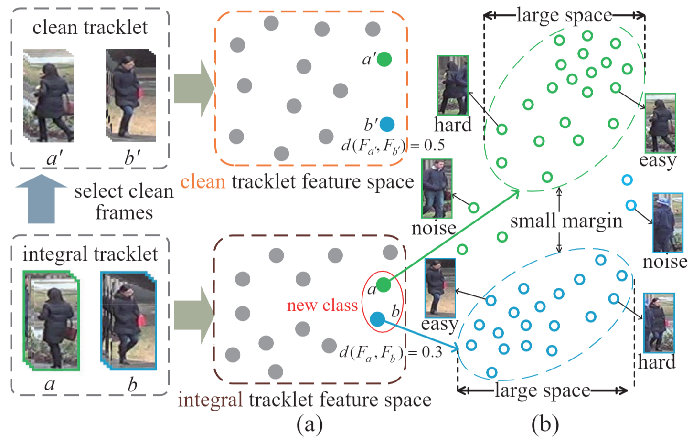
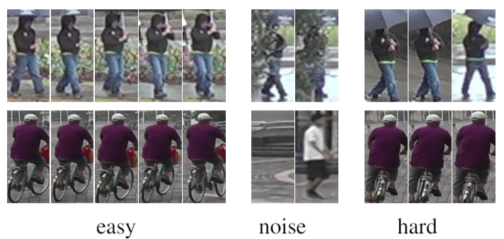
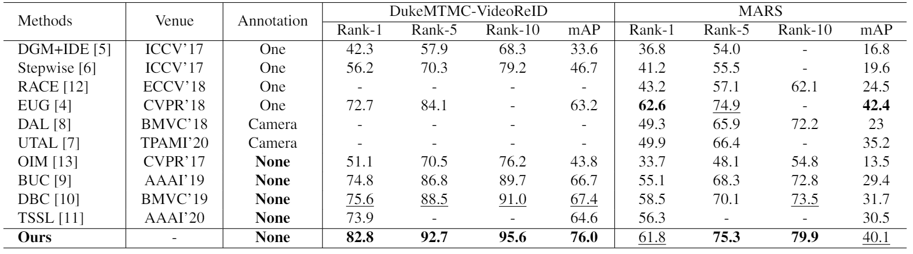
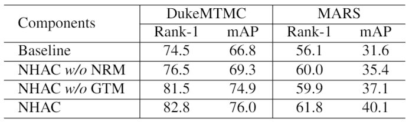
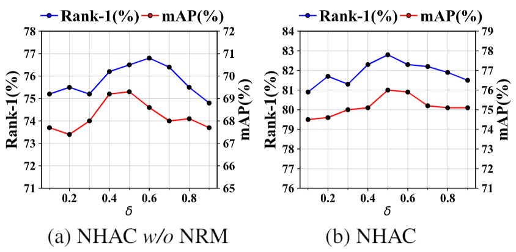
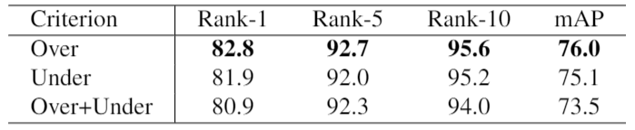
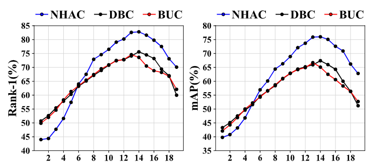
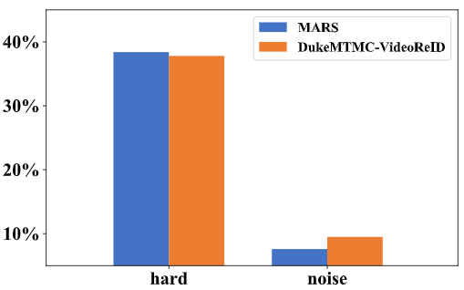

# Unsupervised Video Person Re-identification via Noise and Hard frame Aware Clustering

The *official* repository for [Unsupervised Video Person Re-identification via Noise and Hard frame Aware Clustering](https://arxiv.org/pdf/2106.05441.pdf), ICME 2021. 

Pengyu Xie, Xin Xu, [Zheng Wang](https://wangzwhu.github.io/home/), Toshihiko Yamasaki

The offical paper link is at https://ieeexplore.ieee.org/abstract/document/9428200/. Thank you for your kindly attention.

**The code will be available soon.**

The state-of-the-art methods utilize clustering to obtain pseudo-labels and train the models iteratively. However, they underestimate the influence of two kinds of frames in the tracklet: 1) noise frames caused by detection errors or heavy occlusions exist in the tracklet, which may be allocated with unreliable labels during clustering; 2) the tracklet also contains hard frames caused by pose changes or partial occlusions, which are difficult to distinguish but informative.

## Illustration of the impact of noise and hard frames

**(a)** shows the feature space of integral and clean tracklet features, respectively. Due to the noise frames, the features of tracklets $a$ and $b$ have a high similarity, and they will be wrongly merged during clustering. When noise frames are trimmed, the features of clean tracklets $a'$ and $b'$ are able to be easily distinguished. **(b)** shows the feature space of frames in the tracklet. The hard frames are more scattered than easy frames and do not have the same high aggregation frame feature spaces as easy frames.

## Examples of easy, noise and hard nodes in tracklets

## Experiments

### Comparisons with state-of-the-arts

### Evaluating the components of NHAC on theDukeMTMC-VideoReID and the MARS datasets

### Analysis of the parameter δ on the DukeMTMC-VideoReID dataset

### Comparison of different re-sampling criteria on the DukeMTMC-VideoReID dataset

### The Rank-1 and mAP performances with the different iterations on DukeMTMC-VideoReID dataset

### Percentage of hard and noise nodes in the MARS andDukeMTMC-VideoReID datasets.

